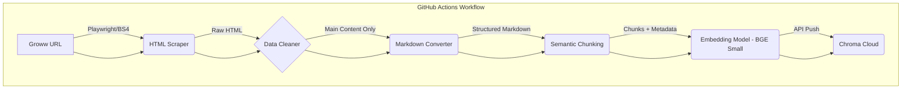

# Architecture: Chunking & Embedding Pipeline

This document details the specialized pipeline for processing HDFC Mutual Fund data from Groww, focusing on how raw HTML is transformed into high-dimensional vector embeddings for the factual Q&A assistant.

## 1. Pipeline Overview

The pipeline is designed for high precision, ensuring that technical data like expense ratios and exit loads are preserved accurately during the transformation.



---

## 2. Granular Step Details

### 2.1. Ingestion & Transformation (HTML to Markdown)
1. **Targeting**: The scraper isolates specific CSS selectors (e.g., `.fund-details-card`, `.expense-ratio-table`) to avoid sidebar noise.
2. **Cleaning**: Remove JavaScript, CSS, and navigation elements.
3. **Conversion**: Transform HTML tables into **Gfm (GitHub Flavored Markdown)** tables. This is crucial as LLMs reason better with Markdown-represented table structures.

### 2.2. Chunking Strategy
To handle financial facts effectively, we use a hybrid chunking approach:

- **Primary Splitter**: `MarkdownHeaderTextSplitter`. This creates chunks based on logical sections like `# Returns`, `## Expense Ratio`, `### Portfolio`.
- **Secondary Splitter**: `RecursiveCharacterTextSplitter`. Applied to any section exceeding **800 tokens**.
- **Context Overlap**: **150 tokens** to ensure cross-chunk continuity (e.g., if a sentence describing a risk is split).
- **Table Handling**: Small tables are kept whole within a single chunk to prevent loss of row/column relationships.

### 2.3. Metadata Schema
Every chunk is enriched with a metadata payload to enable strict filtering and mandatory citations:

| Key | Description | Example |
| :--- | :--- | :--- |
| `scheme_name` | Name of the HDFC fund | `HDFC Mid Cap Fund` |
| `source_url` | Original Groww URL | `https://groww.in/...` |
| `section` | Logical page section | `Expense Ratio & Loads` |
| `last_updated_at` | Timestamp of scrape | `2024-04-17T09:15:00Z` |
| `doc_type` | Type of data | `Web Product Page` |

---

## 3. Embedding Strategy

- **Model**: `BAAI/bge-small-en-v1.5` (Local HuggingFace Pipeline).
- **Dimensions**: 384.
- **Rules of Selection**: 
    - **BGE-Small**: Used for projects with 5 URLs (current scope).
    - **BGE-Base**: Recommended if the scope grows to 20+ URLs.
- **Normalization**: Vectors are normalized to ensure accurate cosine similarity.
- **Computation**: Runs locally on CPU/GPU via the `sentence-transformers` library.

---

## 4. GitHub Actions Orchestration

The pipeline is automated using a GitHub Actions workflow (`.github/workflows/data_sync.yml`).

### Workflow Details:
- **Trigger**: Cron schedule `15 3 * * *` (9:15 AM IST).
- **Environment**: Ubuntu-latest runner with Python 3.10.
- **Steps**:
    1. **Setup**: Install dependencies (`playwright`, `langchain`, `chromadb`).
    2. **Scrape**: Execute `ingest.py` to fetch latest HTML from the 5 HDFC URLs.
    3. **Process**: Run the chunking and embedding logic.
    4. **Persistence**:
        - If using a local ChromaDB: The updated index is committed back to the repository (using LFS) or stored as a build artifact.
        - If using a cloud Vector DB: Vectors are pushed via API.
    5. **Notification**: Send a status ping to a logging service or Slack if the ingest fails.

```yaml
# Conceptual Workflow Snippet
name: Daily Mutual Fund Data Sync
on:
  schedule:
    - cron: '15 3 * * *' # 9:15 AM IST
jobs:
  refresh-vectors:
    runs-on: ubuntu-latest
    steps:
      - uses: actions/checkout@v3
      - name: Run Ingestion Pipeline
        env:
          GEMINI_API_KEY: ${{ secrets.GEMINI_API_KEY }}
        run: |
          python scripts/ingest_sync.py
```
