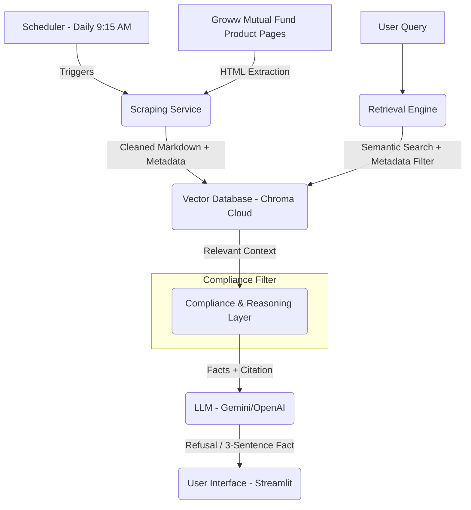

# RAG Architecture: Mutual Fund FAQ Assistant

This document outlines the detailed architecture for the facts-only Mutual Fund FAQ Assistant, designed to provide accurate, source-backed information while strictly avoiding investment advice.

## 1. High-Level System Architecture

The system follows a modular RAG pipeline, prioritizing data integrity and compliance.

---

## 2. Component breakdown

### 2.1. Data Ingestion & Pre-processing
The current scope focuses on extracting facts from official product pages on Groww.

- **Current Scope (HDFC Mutual Funds)**:
    - [HDFC Mid Cap Fund](https://groww.in/mutual-funds/hdfc-mid-cap-fund-direct-growth)
    - [HDFC Equity Fund](https://groww.in/mutual-funds/hdfc-equity-fund-direct-growth)
    - [HDFC Focused Fund](https://groww.in/mutual-funds/hdfc-focused-fund-direct-growth)
    - [HDFC ELSS Tax Saver Fund](https://groww.in/mutual-funds/hdfc-elss-tax-saver-fund-direct-plan-growth)
    - [HDFC Large Cap Fund](https://groww.in/mutual-funds/hdfc-large-cap-fund-direct-growth)

- **Source Connectors**: Playwright or BeautifulSoup-based scrapers targeting Groww fund pages.
- **Parsing**: 
    - No PDFs provided currently.
    - Focus on **HTML-to-Markdown** conversion to extract structured data (expense ratios, exit loads, minimum SIP) directly from web elements.
- **Chunking Strategy**:
    - **Method**: Recursive Character Text Splitting with a focus on semantic section headers (e.g., "Scheme Details", "Expense Ratio").
    - **Size**: 800 tokens with 150 token overlap.
    - **Metadata Enrichment**: Each chunk is tagged with `scheme_name`, `source_url`, and `last_updated`.

### 2.2. Embedding & Vector Storage
- **Model**: `BAAI/bge-small-en-v1.5` (via HuggingFace).
- **Storage**: **Chroma Cloud** (Managed) for centralized storage and zero local management.
- **Indexing**: API-driven indexing with secure tenant/database isolation.

### 2.3. Retrieval Strategy
To ensure zero hallucination and high precision:
1. **Multi-Query Retrieval**: Generate 3 variations of the user query to capture different semantic meanings.
2. **Metadata Filtering**: If the query mentions a specific fund (e.g., "HDFC Flexi Cap"), the search is narrowed down to chunks with matching metadata.
3. **Reranking**: Use a Cross-Encoder (e.g., Cohere Rerank) to select the top 3 most relevant segments from the initial retrieval pool.

### 2.4. Compliance & Reasoning Layer
This layer acts as the "Guardrail" for the system.

- **System Prompting**:
    - "You are a factual financial assistant. You MUST NOT provide opinions or advice."
    - "If context is missing, answer: 'Information not found in official documents.'"
- **Refusal Logic**:
    - Detect advisory keywords ("should I", "better", "best", "compare performance").
    - Logic to trigger pre-defined refusal responses with educational links (SEBI/AMFI).
- **Response Formatting**:
    - Post-processing to enforce the **3-sentence limit**.
    - Automatic citation injection from chunk metadata.

### 2.5. Scheduler & Scraping Service
To ensure the assistant provides the most current data (e.g., latest NAV, updated expense ratios), the system employs an automated refresh cycle.

- **Scheduler**: 
    - **Timing**: Triggered every day at **9:15 AM IST**.
    - **Implementation**: Uses **GitHub Actions** (cron job) or **APScheduler** in a background worker.
- **Scraping Service**:
    - **Function**: Iterates through the list of HDFC fund URLs.
    - **Resilience**: Implements retries and error handling for empty responses or UI changes.
    - **Output**: Generates a set of cleaned Markdown files with embedded metadata for the Vector DB update.

### 2.6. Frontend Layer (User Interaction)
- **Framework**: **Streamlit** or **Gradio** for a minimal, clean interface.
- **Features**:
    - Welcome message & Example questions.
    - Persistent Disclaimer: "Facts-only. No investment advice."
    - Thread history support for multi-turn factual follow-ups.

---

## 3. Compliance & Safety Details

| Constraint | Implementation Detail |
| :--- | :--- |
| **No PII** | Regex filters and PII detection (e.g., Presidio) in input/output streams. |
| **Facts Only** | Strict temperature (0.0) settings and explicit "No Analysis" grounding. |
| **Citations** | Every response block stores parent `source_url` from the retrieved context. |
| **Date Stamp** | Footer injection using `datetime.now()` or document metadata. |

---

## 4. Scalability & Limitations
- **Scalability**: The modular design allows switching from ChromaDB to Pinecone if the corpus grows from 5 to 1000+ documents.
- **Limitations**: Reliance on web structure; updates to the Groww UI may require scraper maintenance.
